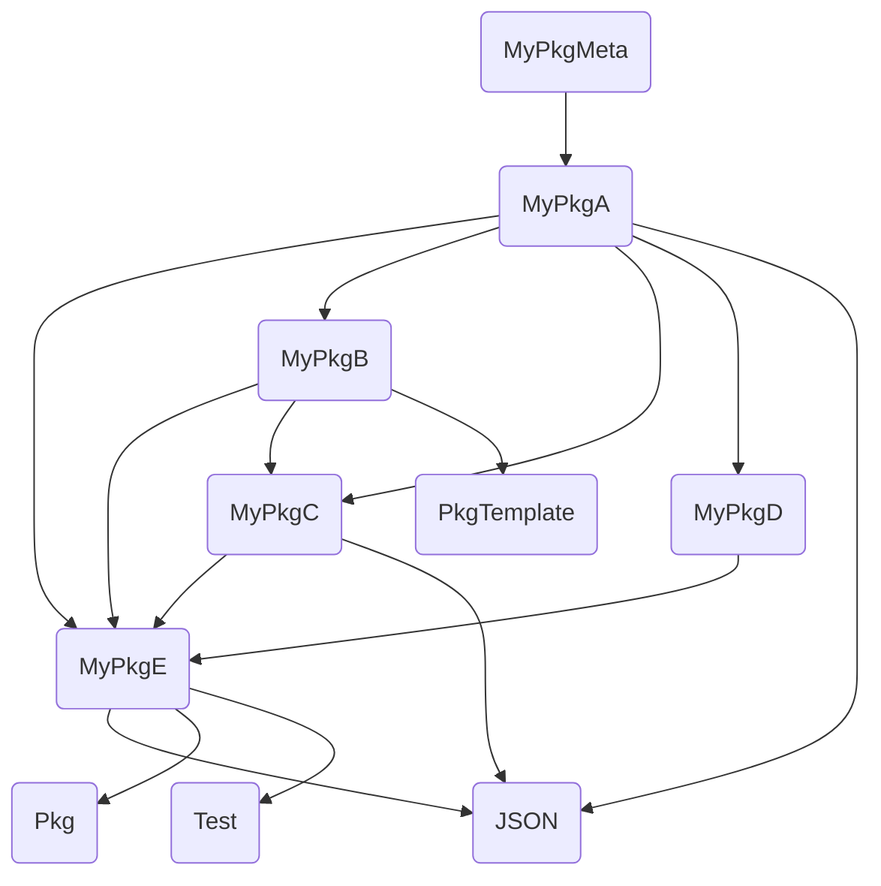

# About

The scripts in this folder perform integration tests with an generated Julia package ecosystem.

Therefore, the `create_package_eco_system()` function in `prepareIntegrationTest.jl` creates various Julia packages and sets the dependencies. The following diagram shows the created package ecosystem.

All packages starting with `MyPkg` are locally created packages. The other packages are third-party dependencies on existing packages from the Julia Registry.

The `MyPkgMeta` is a specially created package. It is not part of the normal package ecosystem and is only needed to generate the correct list of dependencies. For more details, read the the [Integration Test Tool documentation](https://qedjl-project.github.io/IntegrationTests.jl/dev/integration_test_tool/). `MyPkgMeta` has only one dependency, namely the package `MyPkgA`. The `MyPkgA` itself has all other packages as direct dependencies. We use the environment of the `MyPkgMeta` package to construct the dependency tree for the `depending_projects()` function. We cannot use `MyPkgA` directly because a package is not a member of its own dependency graph. This means that `depending_projects()` would not check if `MyPkgA` is a dependency of the package we are looking for, as it is not part of the dependency graph.

# Test scripts

All test scripts use the same example ecosystem but the scripts perform different types of tests:

- `getDeps.jl`: Calls the function `depending_projects()` and compares the generated list of package names with a list of expected package names.
- `generateGithubActions.jl`: Calls the `depending_projects()` function, takes the generated list of package names and print it. Then GitHub Action create and execute a CI job for each entry.
Then creates a GitHub action request for each package name.
