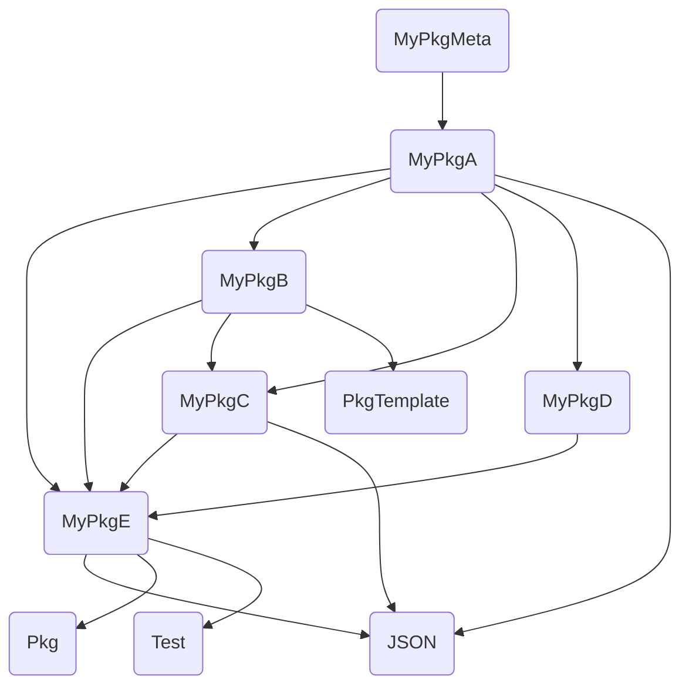

```mermaid
graph TD
   MyPkgMeta(MyPkgMeta) --> MyPkgA(MyPkgA)
   MyPkgA --> MyPkgE(MyPkgE)
   MyPkgA --> MyPkgB(MyPkgB) --> MyPkgE
   MyPkgA --> MyPkgC(MyPkgC) --> MyPkgE
   MyPkgB --> MyPkgC
   MyPkgA --> MyPkgD(MyPkgD) --> MyPkgE

   MyPkgE --> JSON(JSON)
   MyPkgE --> Pkg(Pkg)
   MyPkgE --> Test(Test)

   MyPkgC --> JSON
   
   MyPkgB --> PkgTemplate(PkgTemplate)

   MyPkgA --> JSON
```
