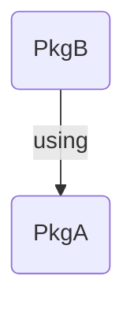

# IntegrationTests

[](https://qedjl-project.github.io/IntegrationTests.jl/main)
[](https://qedjl-project.github.io/IntegrationTests.jl/dev)
[](https://github.com/invenia/BlueStyle)

⚠️ DISCLAIMER ⚠️

This project moves the project independent part of the [integTestGen.jl](https://github.com/QEDjl-project/QED.jl/tree/dev/.ci/integTestGen) script to an external project to make it reusable. If we can use this package in our CI of our QED projects, it is ready for Julia registry and can be used by other projects.

## Roadmap

1. support GitLab CI (version 0.1)
2. support GitHub Workflows (version 0.2)

# About

`IntegrationTests.jl` provides tools and instructions for automatically creating integration tests for Julia projects in continuous integration pipelines such as [GitLab CI](https://docs.gitlab.com/ee/ci/) and [GitHub Actions](https://docs.github.com/en/actions).

# What are integration tests

Integration tests are required if you want to test whether different packages work together after a code change. For example, if package A is used by package B and the API of package A has been changed, the integration test checks whether package B still works.

## Example Project

Our example package eco system contains the two packages `PkgA` and `PkgB`. `PkgB` uses a function from `PkgA`.



`PkgA` provides the following function:

```julia
module PkgA

    foo(i) = i + 3

end
```

`PkgB` uses the function of `PkgA` in the following way:

```julia
module PkgB
using PkgA

    bar() = PkgA.foo(3)

end
```

`PkgB` implements a test that checks whether `bar()` works:

```julia
using PkgB
using Test

@testset "PkgB.jl" begin
    @test PkgB.bar() == 6
end
```

Suppose we change `foo(i) = i + 3` to `foo(i, j) = i + j + 3`. The `bar()` function in `PkgB` will no longer work because `bar()` calls `foo()` with only one parameter. The integration test will detect the problem and allow the developer to fix the problem before the pull request is merged. For example, a fix can be developed for `PkgB` that calls `foo()` with two arguments.

For more details please read the [documentation](https://qedjl-project.github.io/IntegrationTests.jl/main).
