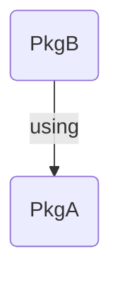
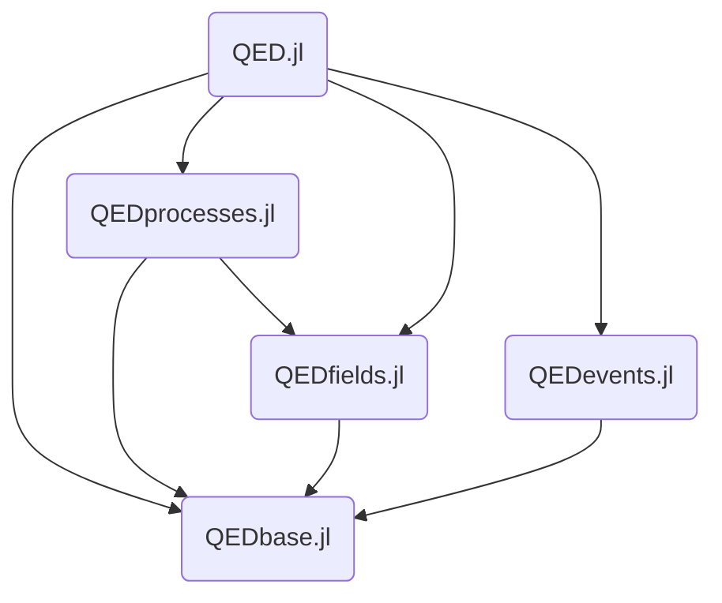

# IntegrationTests.jl

`IntegrationTests.jl` provides tools and instructions for automatically creating integration tests for Julia projects in continuous integration pipelines such as [GitLab CI](https://docs.gitlab.com/ee/ci/) and [GitHub Actions](https://docs.github.com/en/actions).

# What are integration tests

Integration tests are required if you want to test whether different packages work together after a code change. For example, if package A is used by package B and the API of package A has been changed, the integration test checks whether package B still works.

## Example Project

Our example package eco system contains the two packages `PkgA` and `PkgB`. `PkgB` uses a function from `PkgA`.



`PkgA` provides the following function:

```julia
module PkgA

    foo(i) = i + 3

end
```

`PkgB` uses the function of `PkgA` in the following way:

```julia
module PkgB
using PkgA

    bar() = PkgA.foo(3)

end
```

`PkgB` implements a test that checks whether `bar()` works:

```julia
using PkgB
using Test

@testset "PkgB.jl" begin
    @test PkgB.bar() == 6
end
```

Suppose we change `foo(i) = i + 3` to `foo(i, j) = i + j + 3`. The `bar()` function in `PkgB` package will no longer work because `bar()` calls `foo()` with only one parameter. The integration test will detect the problem and allow the developer to fix the problem before the pull request is merged. For example, a fix can be developed for PkgB that calls `foo()` with two arguments.

# Functionality

`IntegrationTests.jl` provides CI configuration files and a tool for the dynamic generation of integration tests for a specific project. The tool determines the dependent packages based on a given `Project.toml` of the entire package ecosystem. This is possible because a `Project.toml` of a package describes the dependencies as a graph. The graph can also contain the dependencies of the dependencies. Therefore, you can create a dependency graph of a package ecosystem. A package ecosystem can look like this:



[Project.toml](https://github.com/QEDjl-project/QED.jl/commit/08613adadea8a85bb4cbf47065d118eaec6f03d6) of the `QED.jl` package.

For example, if `QEDfields.jl` is changed, `IntegrationTests.jl` returns that `QED.jl` and `QEDprocesses.jl` are dependent on `QEDfields.jl`, and we can generate the integration test jobs. Full CI pipeline examples for GitLab CI and GitHub Actions can be found in the [Pipeline Tutorials](@ref) section. For more details on the `IntegrationTests.jl` tool, see the [Integration Test Tool](@ref) section.
