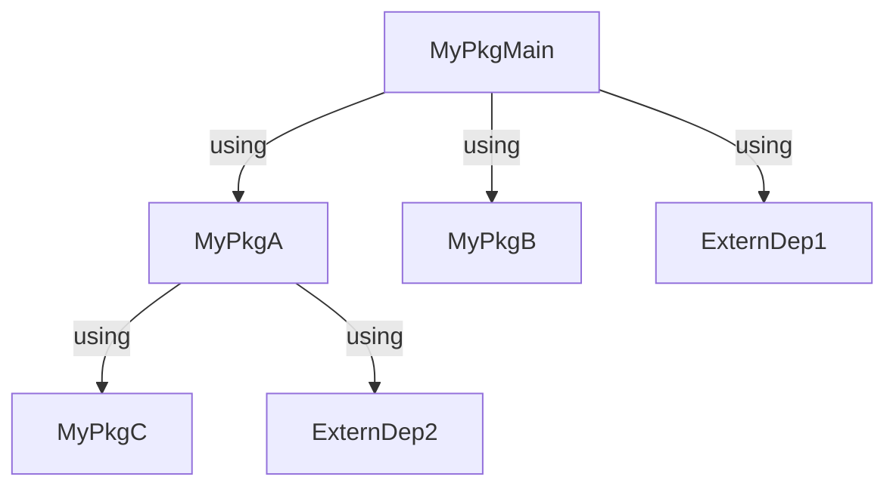
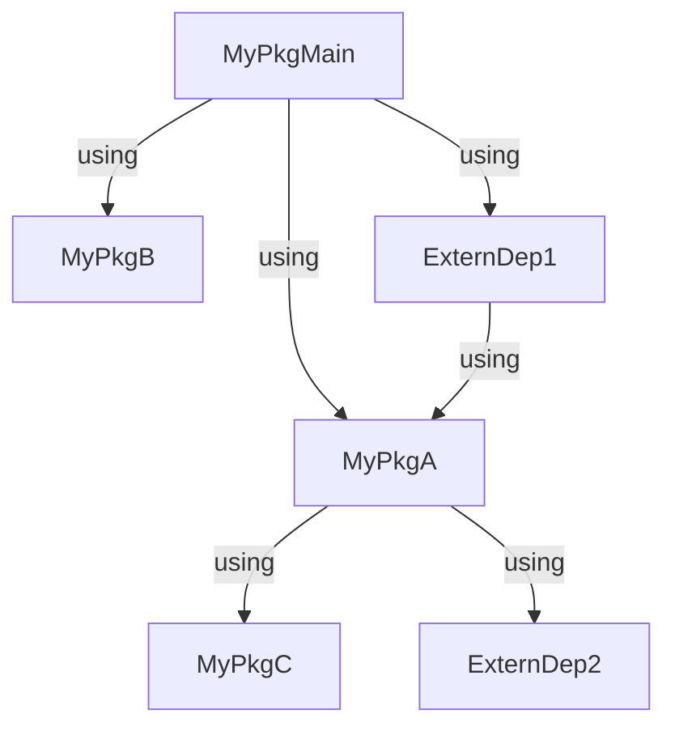
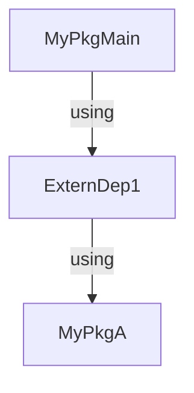
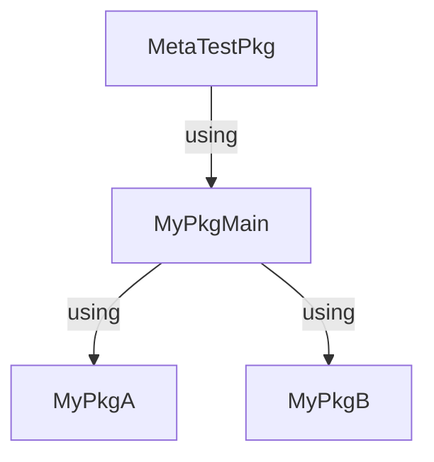
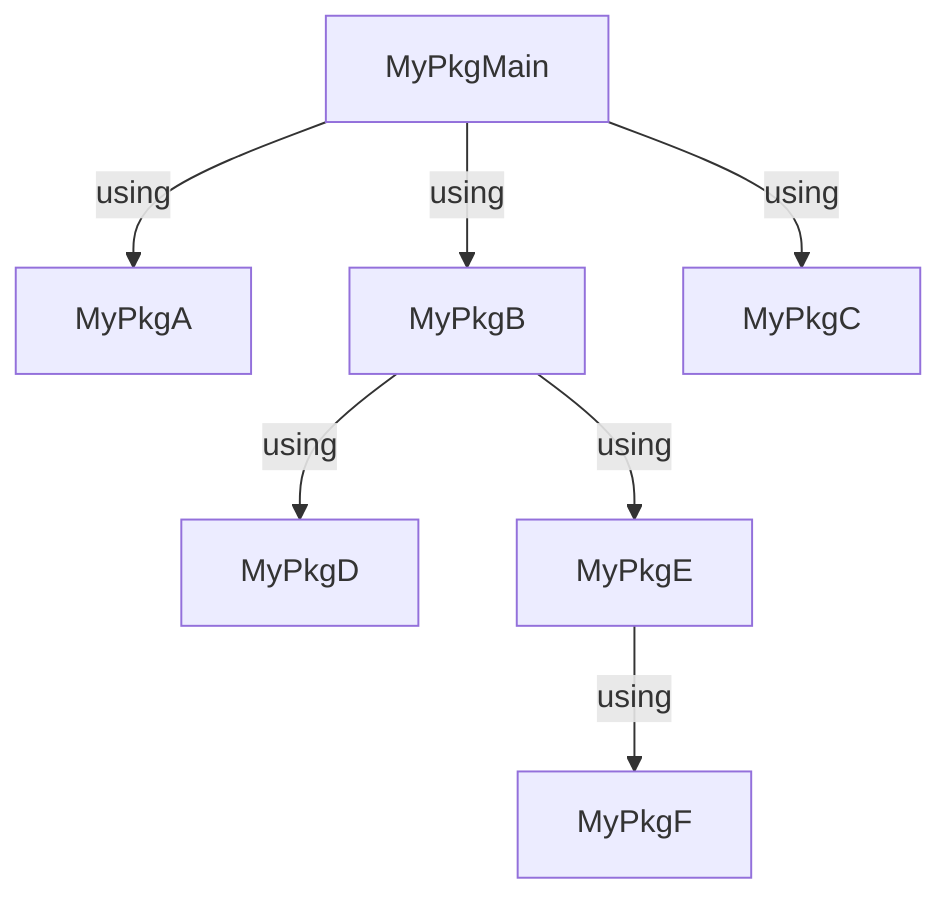
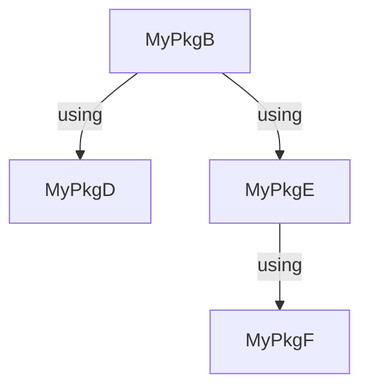
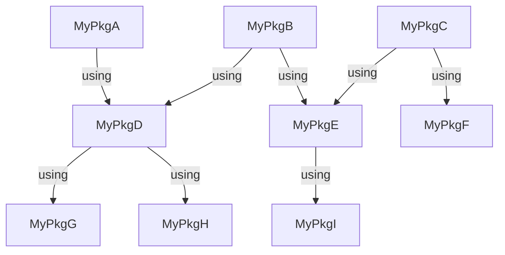
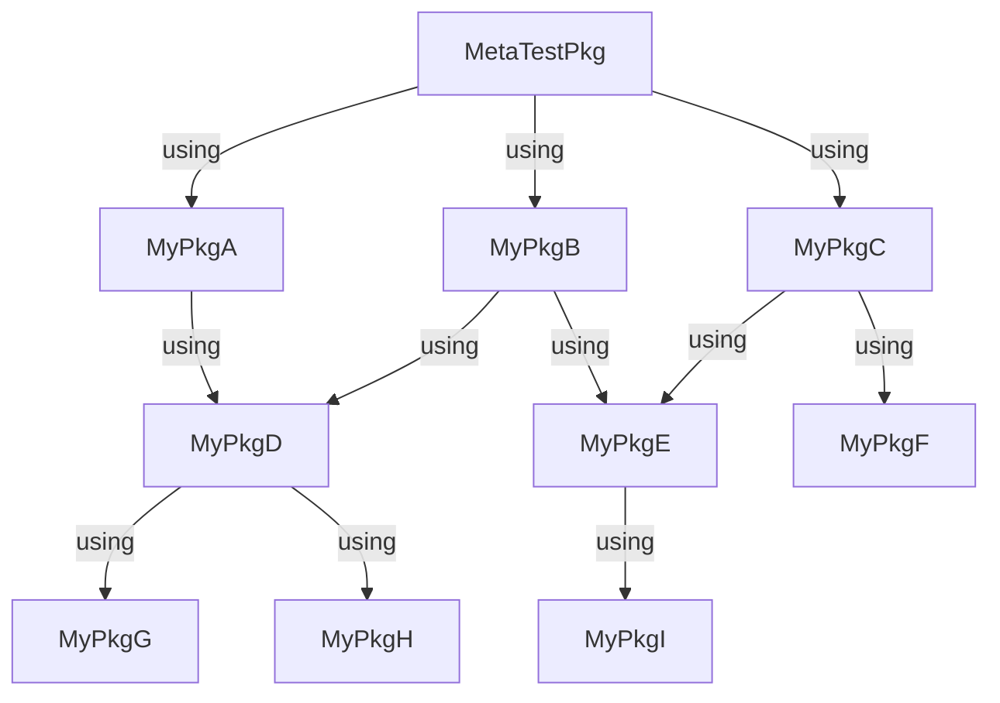

# Integration Test Tool

The public API `IntegrationTests.jl` provides a function called `depending_projects()`, which returns a vector of package names that depend on the package `package_name`. In addition to the package name, the function also requires a package name filter `package_filter` and a project dependency tree `project_tree`. The project dependency can be constructed from the currently active Julia project environment, which is highly recommended.

```@docs
depending_projects(package_name::AbstractString,
    package_filter::Union{<:AbstractString,Regex},
    project_tree::AbstractDict)
```

An example for using the `depending_projects()` function may look as follows:

```julia-repl
julia> using IntegrationTests
[ Info: Precompiling IntegrationTests [6be7cfa2-1838-408e-bc49-3a824ac3a1fb]

julia> using Pkg

julia> Pkg.activate(".ci/example_project/MetaTestPkg/")
  Activating project at `~/projects/IntegrationTests.jl/.ci/example_project/MetaTestPkg`

julia> depending_projects("MyPkgFields", r"MyPkg*")
2-element Vector{String}:
 "MyPkgProcesses"
 "MyPkgMain"

julia>
```

# Package Filter

The `package_filter` is a string or a regular expression, which constrains the search space of the dependency graph. All packages and dependencies of packages must match the filter, otherwise they are ignored during searching. For instance, if we set the package filter to `r"^MyPkg*"`, the packages `MyPkgMain`, `MyPkgA`, `MyPkgB`, and `MyPkgC` are traversed in the following diagram. `ExternalDep1` and `ExternalDep2` are ignored.



The idea behind the package filter is that there are nodes in the dependency graph that can't be changed directly. Let's assume we are the maintainer of all packages starting with `MyPkg` and the following dependency graph is given:



With the package filter `r"*"`, which means traversing all dependencies, the result would be `["MyPkgMain", "ExternDep1"]` if we are searching for `MyPkgA`. We are not the maintainer of `ExternDep1`, therefore we can not directly make changes in `ExternDep1` and it makes less sense to test `ExternDep1` with our code changes.

## Package Filter: Special Cases

### Dependencies of non matching packages

In the following diagram, `MyPkgA` is not found with the package filter `r"^MyPkg*"`, because the traversing algorithm does not traverse `ExternDep1`. Therefore the dependencies of `ExternDep1` are not checked.



### The top graph package

Sometimes the top graph package does not have the same naming scheme as all other packages. The section [Project Dependency Tree](#Project-Dependency-Tree) contains examples of this. If the top package is not included in the package filter, the entire graph is not traversed and the result is empty.



`depending_projects()` returns `[]` for the package filter `r"^MyPkg*"` and the package `MyPkgB`. The package filter `r"^MyPkg*|^MetaTestPkg$` returns `["MyPkgA"]`.

# Project Dependency Tree

We strongly recommend using a `Project.toml` of a package from the package ecosystem as input for `depending_projects()` instead of manually defining the project dependency graph. This is because a manually defined dependency tree can become obsolete. In contrast, the `Project.toml` must be up to date, otherwise, the Julia application will not work.

The crucial question is which `Project.toml` should be used. The dependency graph of a `Project.toml` can only be constructed in one direction. You can only use the dependencies of the packages. From which package a package is used can only be determined if you came from the package before. Let's assume we have the following package ecosystem:



If we take the `Project.toml`[\*] of `MyPkgMain`, we get the complete graph. If we take the `Project.toml` of `MyPkgB`, we get the following graph:



!!! note

    The dependency tree created with the `Project.toml` of `MyPkgMain` does not contain `MyPkgMain` itself. This is a technical detail from Julia. It will contain the dependencies `MyPkgA` to `MyPkgF`. To solve the problem, an additional package is needed, which has only the dependency `MyPkgMain`:

    `Project.toml`
    ```yaml
    name = "MetaTestPkg"
    uuid = "b849e8ad-e76f-4e2e-b89d-52f4e57509ba"
    authors = ["Simeon Ehrig <s.ehrig@hzdr.de>"]
    version = "0.1.0"

    [deps]
    MyPkgMain = "679daff0-1f79-468a-9a2e-69c3994cafb1"
    ```

    If we use the `Project.toml` of `MetaTestPkg`, we get the complete dependency graph with `MyPkgMain`.

!!! note

    To select a package and create the dependency graph, you need to activate the Julia environment of the package with `Pkg.activate()`. For example, `Pkg.activate("path/to/MetaTestPkg")`.

## Project Dependency Tree: Special cases

Let's assume we have the following package ecosystem structure:



There is no package we can use to build the entire dependency graph. Therefore, an auxiliary package is required to generate the integration tests for the whole ecosystem:



If we use the `Project.toml` of `MetaTestPkg`, we can construct the entire graph.

!!! note

    The "MetaTestPkg" does not need to be registered. It can be saved locally in the project repository or created dynamically during the generation of the integration tests.
